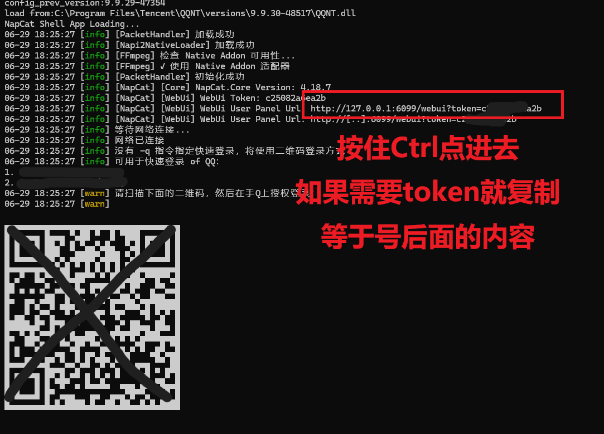
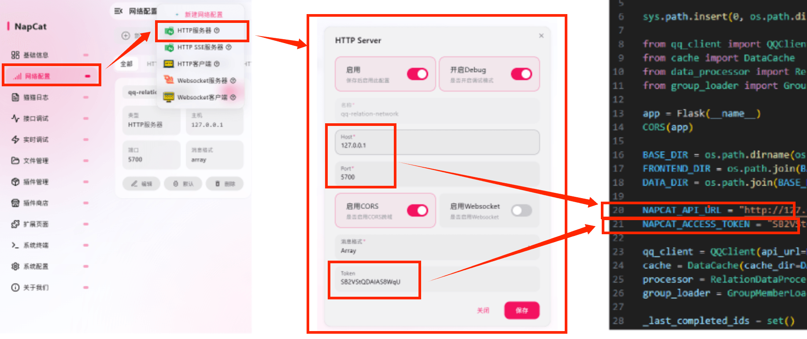

# QQ 关系网可视化工具

一个可以可视化你的QQ社交关系网络的小工具。通过登录QQ获取好友列表和群列表，构建关系链，并以力导向图的形式展示。

*Made with TRAE Solo*

## 功能特性

- 👤 **好友列表**：获取所有好友，展示好友关系
- 👥 **群列表**：获取所有加入的群
- 📊 **群成员**：获取群成员，构建群-成员关系
- 🎨 **彩色区分**：自己（金色）、好友（深蓝色白色边框）、共群好友（浅蓝色）、仅同群（浅灰蓝）、群（红色白色边框）
- 📏 **节点大小分级**：基于对数标度，百人群/千人群/万人群视觉区分明显
- ✨ **群节点边框分级**：体量越大白色边框越宽
- 🚀 **多线程加载**：多线程并发加载群成员，提升速度
- ⚡ **实时更新**：加载一个群就更新一次网络图，渐进式展示
- 📈 **进度展示**：实时显示加载进度
- 🖱️ **交互丰富**：缩放、悬停查看详情、单击进入一级关系网
- 🎯 **多选模式**：多选节点查看多个节点之间的关系网
- ⚙️ **自适应性能**：根据节点数量自动调整力导向参数和渲染质量
- 💾 **数据缓存**：本地缓存数据，避免重复请求
- 📊 **性能监测**：实时显示性能等级和节点数量

## 技术栈

- **后端**：Python + Flask
- **前端**：HTML + CSS + JavaScript + ECharts
- **QQ协议端**：NapCatQQ（基于NTQQ）
- **并发**：ThreadPoolExecutor 多线程
- **布局算法**：Barnes-Hut 力导向布局（后端预计算）
- **分级渲染**：5级性能自适应降级策略

---

## 配置指南

### 1. 安装 NapCatQQ

这是获取QQ数据的前提。NapCatQQ是一个基于NTQQ的协议端，可以让你通过API获取QQ数据。

**Windows  Shell（推荐）：**

1. 下载地址：https://github.com/NapNeko/NapCatQQ/releases
2. 下载最新版本的 `NapCat.Shell.zip`
3. 双击目录下 `launcher.bat` 即可启动 如果是 Win10 则使用 `launcher-win10.bat`
4. 扫码登录你的QQ账号
5. 在"网络配置"中添加 HTTP 服务：
   - 类型：HTTP API
   - 监听地址：`127.0.0.1`
   - 端口：`5700`
   - 复制访问令牌（Token）
   - 勾选"启用"



6. 保存配置并重启 NapCat

### 2. 配置后端

打开 `backend/app.py`，修改以下配置：

```python
NAPCAT_API_URL = "http://127.0.0.1:5700"
NAPCAT_ACCESS_TOKEN = "你的访问令牌"
```



- `NAPCAT_API_URL`：NapCatQQ 的 HTTP API 地址，默认 `http://127.0.0.1:5700`
- `NAPCAT_ACCESS_TOKEN`：你在 NapCatQQ 中设置的访问令牌

### 3. 安装 Python 依赖

确保你已安装 Python 3.8+。

```bash
cd backend
pip install -r requirements.txt
```

### 4. 启动服务

```bash
cd backend
python app.py
```

启动成功后会显示：

```
============================================================
  QQ 关系网可视化工具
============================================================
  前端地址: http://127.0.0.1:5000
  数据目录: D:\path\to\data
============================================================
```

### 5. 访问页面

打开浏览器访问：http://127.0.0.1:5000

---

## 使用说明

### 基本操作

1. **连接状态**：右上角显示 NapCat 是否连接正常
2. **性能等级**：右上角显示当前性能等级（流畅/良好/标准/性能/极速）
3. **加载群成员**：点击"加载全部群成员"按钮开始加载
4. **进度查看**：顶部进度条显示加载进度
5. **停止加载**：点击"停止"按钮可随时暂停
6. 单个加载：在左侧群列表中点击某个群可单独加载

### 显示选项

- 可以切换显示/隐藏：自己、好友、共群好友、仅同群、群
- 可以切换显示/隐藏节点标签
- 群列表支持搜索过滤
- 节点类型后面显示对应数量

### 多选模式

1. 点击"☑️ 多选模式"按钮进入多选模式
2. 节点会淡化（30%透明度），点击节点进行选择/取消
3. 选择至少2个节点后，再次点击按钮查看关系网
4. 在关系网模式下点击按钮可完全退出多选模式

### 加载设置

- **线程数**：可调整并发加载的线程数（1-8）
- 建议使用默认3线程，平衡速度和安全性

### 交互操作

- **拖拽画布**：鼠标左键拖拽空白处移动视图
- **缩放**：鼠标滚轮缩放视图
- **悬停**：鼠标悬停节点查看详情弹窗
- **单击**：单击节点进入一级关系网
- **空白处点击**：退出一级关系网/多选关系网

---

## 节点类型说明

| 颜色 | 类型 | 说明 |
|------|------|------|
| 🟡 金色 | 自己 | 你的QQ账号 |
| 🔵 深蓝色 #4A90D9 | 好友 | 你的QQ好友（白色1px边框） |
| 🔵 浅蓝色 #87CEEB | 共群好友 | 和你有共同群的好友 |
| 🔵 浅灰蓝 #B0C4DE | 仅同群 | 只在同一个群里、不是好友的人 |
| 🔴 红色 #E74C3C | 群 | 你加入的QQ群（白色边框，体量越大越宽） |

### 节点大小说明

节点大小采用对数标度计算（8-80px），关联越多节点越大：

| 大小 | 边框宽度 | 说明 |
|------|----------|------|
| 小 | 0px | 少量关联（<10） |
| 中 | 2px | 数十人 ~ 百人群（10~999） |
| 大 | 3px | 千人群（1k~9k） |
| 超大 | 4px | 万人群（1万+） |

---

## 性能优化

### 自适应力导向参数

根据节点数量动态调整力导向参数，保证不同数据量下的最佳表现：

| 节点数 | 等级 | 说明 |
|--------|------|------|
| ≤ 100 | 流畅 | 最高质量动画 |
| 101 ~ 500 | 良好 | 平衡质量与性能 |
| 501 ~ 2000 | 标准 | 性能优先 |
| 2001 ~ 10000 | 性能 | 降级渲染 |
| > 10000 | 极速 | 最低画质 |

### 自动降级策略

当节点数量过多或渲染耗时过长时，系统会自动关闭部分功能以保证流畅：

- **标签**：节点过多时自动隐藏
- **共同群好友**：超大数量时自动隐藏
- **仅同群**：极限数量时自动隐藏

### 增量渲染优化

加载群成员时使用增量更新策略，避免全量重绘，提升加载过程中的用户体验。

---

## 项目结构

```
qq-relation-network/
├── backend/                 # 后端服务
│   ├── app.py              # Flask 主应用（配置文件在此）
│   ├── qq_client.py        # OneBot API 封装
│   ├── data_processor.py   # 关系链构建、节点大小计算
│   ├── group_loader.py     # 多线程群成员加载器
│   ├── cache.py            # 数据缓存
│   └── requirements.txt    # Python 依赖
├── frontend/               # 前端页面
│   ├── index.html          # 主页面
│   ├── css/
│   │   └── style.css       # 样式
│   └── js/
│       ├── app.js          # 前端核心逻辑
│       └── force-config.js # 力导向参数配置
├── data/                   # 数据缓存目录（自动创建）
└── README.md
```

---

## API 接口

| 接口 | 方法 | 说明 |
|------|------|------|
| `/api/status` | GET | 检查连接状态 |
| `/api/friends` | GET | 获取好友列表 |
| `/api/groups` | GET | 获取群列表 |
| `/api/group_members/<group_id>` | GET | 获取指定群成员 |
| `/api/start_loading` | POST | 开始批量加载群成员 |
| `/api/loading_progress` | GET | 获取加载进度 |
| `/api/stop_loading` | POST | 停止加载 |
| `/api/relation_data` | GET | 获取完整关系网数据 |
| `/api/reset` | POST | 重置数据 |

---

## ⚠️ 风险提示

### 账号安全

- 使用第三方协议端登录QQ**有一定风控风险**
- 建议**先用小号测试**，确认没问题再用主号
- 不要将线程数设置过高，避免频繁请求
- 开启设备锁，保持手机QQ在线

### 隐私合规

- 本工具**仅限个人本地使用**
- 请勿公开或传播他人QQ信息
- 所有数据仅保存在本地，不上传任何服务器

---

## 常见问题

**Q: 打开页面显示"未连接"怎么办？**
A: 请确认 NapCatQQ 已启动并登录，且 HTTP API 已配置在 5700 端口，access token 填写正确。

**Q: 加载群成员很慢？**
A: 为了账号安全，默认有请求频率限制。可以适当增加线程数，但不建议超过5个。

**Q: 数据存在哪里？**
A: 存在 `data/` 目录下的 JSON 文件中，都是本地存储。

**Q: 可以只加载某些群吗？**
A: 可以，在左侧群列表中点击单个群单独加载。

**Q: 如何重置数据？**
A: 直接删除 `data/` 目录，重新加载即可。

**Q: 节点太多太卡怎么办？**
A: 系统会自动降级，也可以手动关闭"仅同群"、"标签"等选项提升性能。

**Q: 为什么节点不能拖动？**
A: 为了布局稳定性，节点设置为不可拖动。可以使用滚轮缩放和拖拽画布来查看。
